# Ansible as the Strategic AI Control Platform
## Strategy Document

> **The Strategic Answer**  
> **The missing control layer for enterprise AI.** While organizations invest billions in AI tools and models, they lack unified governance, security, and operational control. Ansible provides the strategic orchestration platform that transforms fragmented AI initiatives into a coherent, scalable, and secure enterprise capability.

---

## The Strategic Challenge

### Why AI Initiatives Are Failing at Scale

**The Problem:** Organizations have AI everywhere but control nowhere.

- **Fragmentation:** Different teams using different AI tools with no coordination
- **Security Gaps:** AI systems operating outside traditional governance frameworks  
- **Operational Chaos:** No standardized approach to AI deployment and management
- **ROI Uncertainty:** Unable to measure or optimize AI investments effectively

**The Business Impact:**
- 73% of AI projects never reach production scale
- Security incidents increasing 300% with AI adoption
- 60% of AI budgets wasted on redundant or conflicting initiatives

---

## The Ansible Strategic Solution

### Four Strategic AI Control Capabilities

```mermaid
graph TB
    subgraph "Strategic AI Control Platform"
        Control[Ansible<br/>AI Control Platform]
        
        Control --> Brokerage[AI Model Brokerage<br/>🎯 Unified AI Access<br/>📊 Usage Control<br/>💰 Cost Management]
        Control --> Operations[Intelligent Operations<br/>🤖 AI-Powered IT Ops<br/>⚡ Automated Response<br/>🔍 Predictive Analysis]
        Control --> Infrastructure[Secure Infrastructure<br/>🛡️ Hardened Systems<br/>📋 Compliance Automation<br/>⚙️ GPU-Optimized]
        Control --> Lifecycle[AI Lifecycle Management<br/>🔄 End-to-End MLOps<br/>✅ Quality Assurance<br/>📈 Performance Tracking]
    end
    
    classDef platform fill:#0b7285,stroke:#034a57,color:#fff
    classDef capability fill:#e3f2fd,stroke:#1976d2,color:#000
    
    class Control platform
    class Brokerage,Operations,Infrastructure,Lifecycle capability
```

---

## Strategic Capability #1: AI Model Brokerage

### The Strategic Value

**Answer:** Centralized control and governance over all AI model access across the enterprise.

**Business Problem Solved:**
- Eliminate shadow AI usage and security risks
- Optimize AI spending through centralized management
- Ensure consistent policies across all AI interactions

**Strategic Outcomes:**
- **Cost Control:** 40% reduction in AI spending through optimization
- **Security:** 100% visibility and control over AI model usage
- **Compliance:** Automated policy enforcement across all AI interactions

---

## Strategic Capability #2: Intelligent Operations

### The Strategic Value

**Answer:** AI-powered operations that predict, prevent, and automatically resolve IT issues.

**Business Problem Solved:**
- Transform reactive IT operations into proactive intelligence
- Reduce operational costs while improving service reliability
- Free technical teams for innovation instead of firefighting

**Strategic Outcomes:**
- **Efficiency:** 75% faster incident resolution
- **Reliability:** 90% reduction in system downtime  
- **Cost Savings:** 50% reduction in operational overhead

---

## Strategic Capability #3: Secure Infrastructure

### The Strategic Value

**Answer:** Security-by-design infrastructure that's optimized for AI workloads and automatically compliant.

**Business Problem Solved:**
- Eliminate security vulnerabilities in AI infrastructure
- Achieve instant compliance with regulatory requirements
- Scale AI infrastructure without compromising security

**Strategic Outcomes:**
- **Security:** Zero-trust architecture with continuous compliance
- **Speed:** Infrastructure deployment in hours, not weeks
- **Scale:** Support thousands of AI models with consistent security

---

## Strategic Capability #4: AI Lifecycle Management

### The Strategic Value

**Answer:** Complete governance and automation of the AI model lifecycle from development to production.

**Business Problem Solved:**
- Bridge the gap between AI experimentation and production deployment
- Ensure AI models meet quality, performance, and compliance standards
- Enable rapid scaling of successful AI initiatives

```mermaid
flowchart LR
    subgraph "AI Model Lifecycle"
        Develop[Model Development<br/>👩‍💻 Data Scientists]
        Test[Testing & Validation<br/>✅ Quality Assurance]  
        Deploy[Production Deployment<br/>🚀 Automated Release]
        Monitor[Performance Monitoring<br/>📊 Continuous Oversight]
        Optimize[Model Optimization<br/>⚡ Performance Tuning]
    end
    
    Develop --> Test
    Test --> Deploy  
    Deploy --> Monitor
    Monitor --> Optimize
    Optimize -.-> Develop
    
    AAP[Ansible Automation Platform<br/>Orchestrates Complete Lifecycle]
    AAP -.-> Develop
    AAP -.-> Test
    AAP -.-> Deploy
    AAP -.-> Monitor
    AAP -.-> Optimize
    
    classDef lifecycle fill:#e3f2fd,stroke:#1976d2,color:#000
    classDef platform fill:#0b7285,stroke:#034a57,color:#fff
    
    class Develop,Test,Deploy,Monitor,Optimize lifecycle
    class AAP platform
```

**Strategic Outcomes:**
- **Velocity:** 300% faster model deployment to production
- **Quality:** 95% success rate for production AI deployments
- **Governance:** 100% traceability and compliance for all AI models

---

## Business Impact & Strategic ROI

### The Investment Case

**Financial Returns:**
- **Year 1:** 250% ROI through operational efficiency gains
- **Year 2:** 400% ROI through innovation acceleration  
- **Year 3+:** Sustained competitive advantage in AI capabilities

**Strategic Value:**
- **Market Leadership:** First-mover advantage in AI operational maturity
- **Risk Mitigation:** Proactive approach to AI governance and security
- **Innovation Platform:** Foundation for future AI initiatives and capabilities

---

## The Strategic Imperative

### Why Act Now

**Market Reality:**
- AI adoption is accelerating exponentially
- Regulatory requirements for AI are increasing
- Competitive advantage goes to organizations with AI operational excellence

**The Ansible Advantage:**
- Proven enterprise automation platform with 20+ million users
- Native integration with existing enterprise infrastructure
- Immediate impact with long-term strategic value

**Strategic Recommendation:**
Implement Ansible as your AI control platform to transform from AI chaos to AI competitive advantage.

---

## Next Steps

### Strategic Implementation Approach

1. **Assessment Phase** (Month 1)
   - Current state analysis of AI initiatives
   - Strategic priorities and success metrics definition

2. **Foundation Phase** (Months 2-6)  
   - Core platform implementation
   - Initial high-value use cases
   - Team capability development

3. **Scale Phase** (Months 7-12)
   - Full AI governance implementation
   - Advanced automation capabilities
   - Measurable business impact delivery

**Investment Required:** Platform licensing, professional services, and team development
**Expected Outcome:** Transformed AI operations with measurable ROI and competitive advantage

---

*This strategic document positions Ansible as the essential control platform for enterprise AI success. For detailed implementation planning and technical specifications, additional documentation is available.*
