# Ansible as a Strategic Platform for AI and Enterprise Automation

> **Answer (Executive Summary)**  
> Ansible is an **infrastructure management and configuration platform** that provides the automation backbone for AI and enterprise workloads. It does not train or run models; instead, it **brokers control, enforces policy, and orchestrates repeatable operations** across hybrid and multi-cloud estates.  
>
> **Priority use cases:**  
> 1) **MCP Brokerage** → unify control, security, and policy across clouds, clusters, and domains  
> 2) **AI-Enabled IT Operations (AIOps)** → event-driven remediation with LLM-assisted RCA & curated playbooks  
> 3) **Infrastructure Provisioning & Configuration** → secure, hardened, RBAC-controlled, GPU-enabled estates  
> 4) **MLOps & CI/CD Pipelines** → repeatable data → train → register → deploy → observe flows  
>
> **Constraints:** Ansible is not an ML framework, is largely stateless per run, requires external observability, and benefits from containers for dependency isolation.

---

## Table of Contents
- [1. Why Ansible (Minto: Key Points)](#1-why-ansible-minto-key-points)
- [2. Use Case #1 — MCP Brokerage](#2-use-case-1--mcp-brokerage)
- [3. Use Case #2 — AI-Enabled IT Operations (AIOps)](#3-use-case-2--ai-enabled-it-operations-aiops)
- [4. Use Case #3 — Infrastructure Provisioning & Configuration](#4-use-case-3--infrastructure-provisioning--configuration)
- [5. Use Case #4 — MLOps & CI/CD Pipelines](#5-use-case-4--mlops--cicd-pipelines)
- [6. Constraints & Limitations](#6-constraints--limitations)
- [7. Implementation Pointers](#7-implementation-pointers)
- [8. Appendix — Symbols Legend](#8-appendix--symbols-legend)

---

## 1. Why Ansible (Minto: Key Points)

### Strategic Value Proposition

**Answer:** Ansible serves as the **unified control plane** for enterprise AI and hybrid cloud operations, providing policy enforcement, security, and operational consistency across diverse infrastructure.

**Supporting Arguments:**
1. **Cross-Domain Orchestration** → Single platform manages network, compute, storage, security, and containerized workloads
2. **Policy-as-Code Enforcement** → Ensures compliance, security baselines, and operational standards
3. **Event-Driven Automation** → Proactive remediation through AI-assisted root cause analysis
4. **Vendor-Agnostic Approach** → Works across cloud providers, on-premises, and edge environments

### Core Architecture Overview

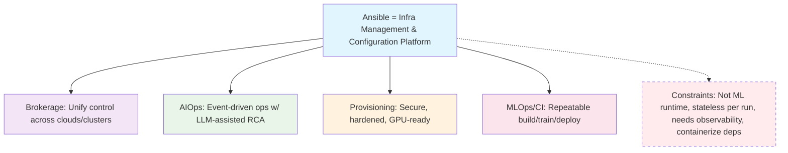

### Multi-Domain Control Architecture

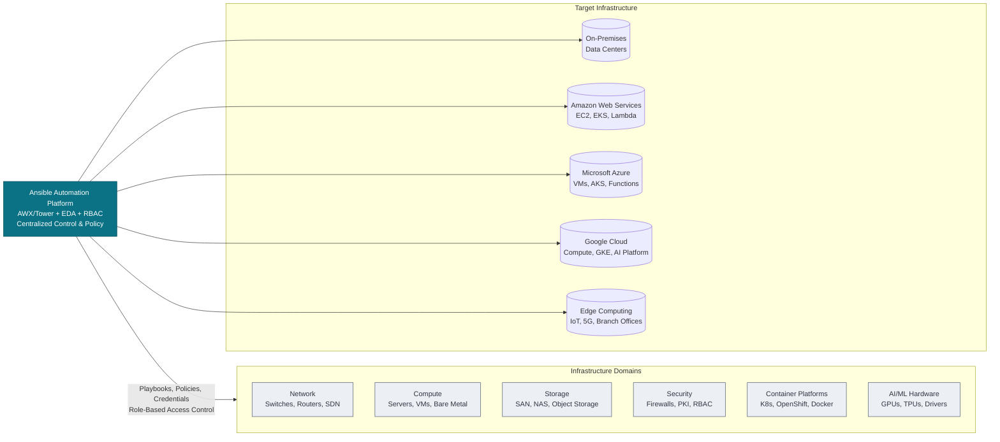

### AI-Driven Operations Flow

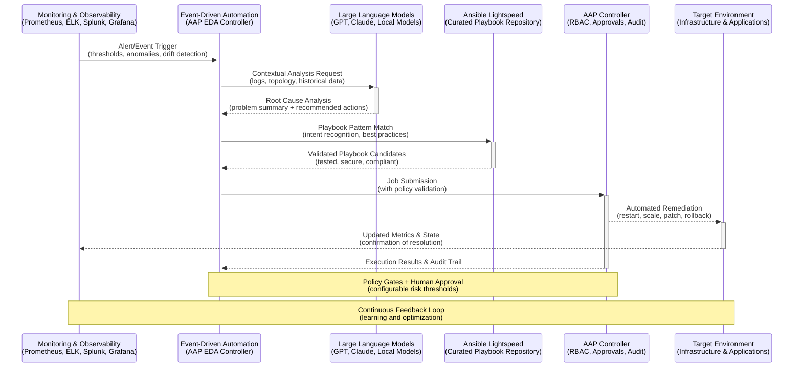

### Infrastructure Provisioning Pipeline

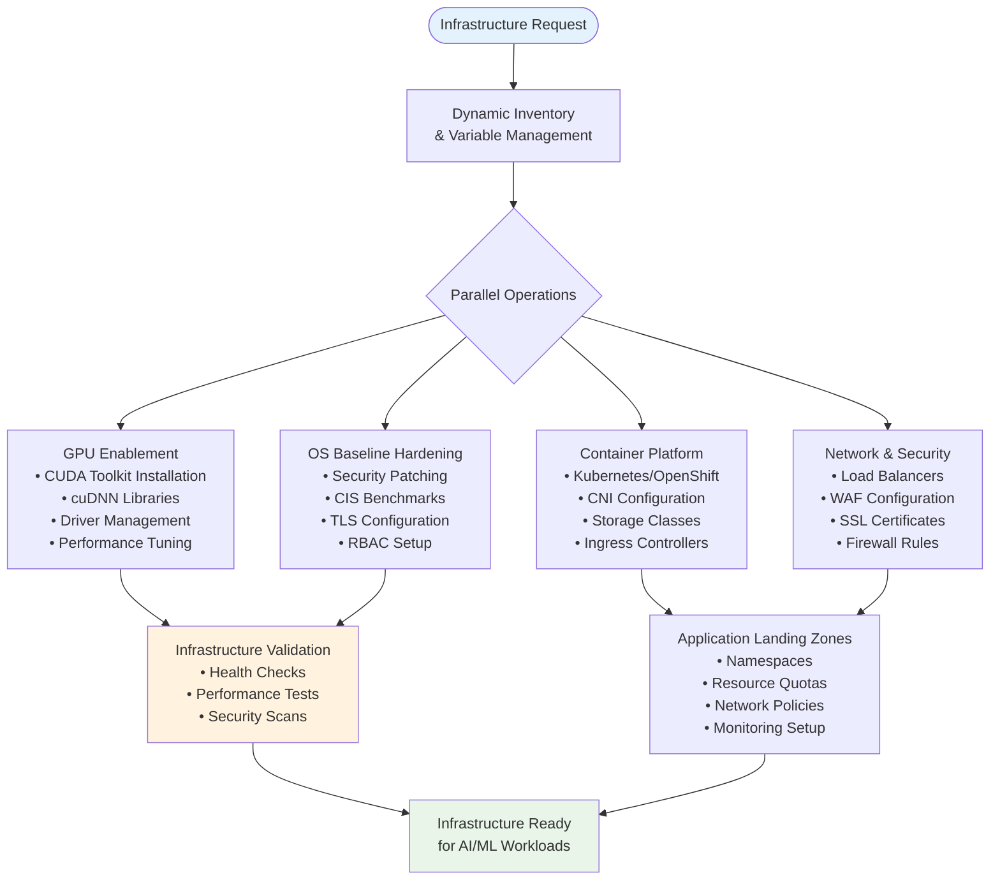

### MLOps CI/CD Pipeline Architecture

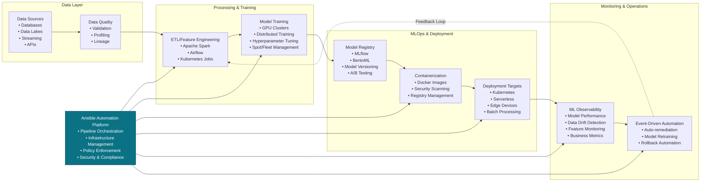

### Constraints and Design Considerations

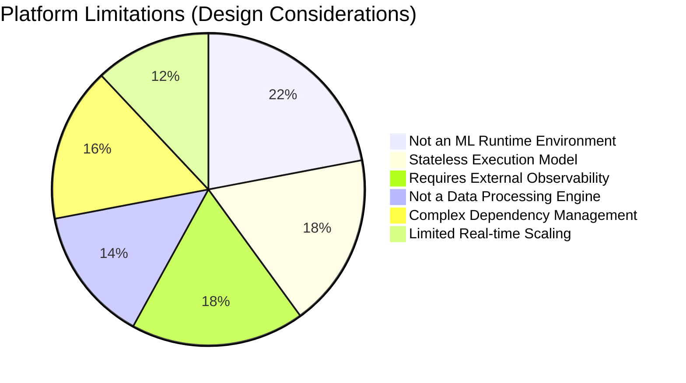

**Key Design Principles:**
- **Separation of Concerns**: Ansible orchestrates, doesn't execute ML workloads
- **Idempotent Operations**: Playbooks ensure consistent, repeatable outcomes
- **Policy-First Approach**: Security and compliance built into every automation
- **Event-Driven Architecture**: Reactive and proactive operational responses
- **Container-Native**: Leverage containers for complex dependency management

---

## 2. Use Case #1 — MCP Server Brokerage (Model Context Protocol)

### Strategic Answer

**Problem:** Organizations need to provide AI systems with access to diverse tools, data sources, and enterprise resources, but managing connections to multiple MCP servers creates complexity, security risks, and governance challenges.

**Solution:** Ansible serves as the **unified orchestration layer** that brokers access to MCP servers, enforces policies, and manages the lifecycle of tool and resource integrations across heterogeneous environments.

### Supporting Arguments

1. **Centralized MCP Server Governance**: Single point for access control, usage policies, and compliance across all MCP server connections
2. **Cross-Platform Integration**: Unified interface to GitHub MCP servers, database connectors, file systems, APIs, and enterprise tools  
3. **Policy Enforcement**: Consistent security, data governance, and usage controls for all MCP server interactions
4. **Resource Optimization**: Intelligent routing, connection pooling, and resource management across MCP server endpoints

### MCP Server Orchestration Architecture

```mermaid
graph TB
    subgraph "Enterprise AI Systems"
        Apps[AI Applications<br/>• Chatbots<br/>• Analytics<br/>• Code Generation]
        DevTools[Developer Tools<br/>• IDEs<br/>• CI/CD Pipelines<br/>• Testing Frameworks]
        BizProc[Business Processes<br/>• Content Generation<br/>• Data Analysis<br/>• Decision Support]
    end

    subgraph "Ansible MCP Server Broker Layer"
        MCPBroker[MCP Server Broker Controller<br/>• Connection Routing<br/>• Policy Enforcement<br/>• Usage Tracking<br/>• Resource Management]
        
        subgraph "Policy & Governance"
            PolicyEngine[Policy Engine<br/>• Access Control<br/>• Data Classification<br/>• Usage Quotas<br/>• Compliance Rules]
            AuditLog[Audit & Logging<br/>• Tool Usage Tracking<br/>• Performance Metrics<br/>• Security Events]
        end
    end

    subgraph "MCP Server Ecosystem"
        subgraph "Development & Code MCP Servers"
            GitHub[GitHub MCP Server<br/>• Repository Management<br/>• Issue Tracking<br/>• Code Reviews<br/>• CI/CD Integration]
            GitLab[GitLab MCP Server<br/>• Project Management<br/>• Merge Requests<br/>• Pipeline Control]
        end
        
        subgraph "Data & Enterprise MCP Servers"
            Database[Database MCP Server<br/>• SQL Queries<br/>• Schema Management<br/>• Data Access Control]
            FileSystem[File System MCP Server<br/>• File Operations<br/>• Directory Management<br/>• Content Search]
            ITSM[ITSM MCP Server<br/>• ServiceNow<br/>• Jira Integration<br/>• Ticket Management]
        end
        
        subgraph "Cloud & Infrastructure MCP Servers"
            AWS[AWS MCP Server<br/>• Resource Management<br/>• Service Control<br/>• Cost Monitoring]
            K8s[Kubernetes MCP Server<br/>• Cluster Management<br/>• Pod Operations<br/>• Service Discovery]
        end
    end

    Apps --> MCPBroker
    DevTools --> MCPBroker
    BizProc --> MCPBroker
    
    MCPBroker --> PolicyEngine
    MCPBroker --> AuditLog
    
    MCPBroker --> GitHub
    MCPBroker --> GitLab
    MCPBroker --> Database
    MCPBroker --> FileSystem
    MCPBroker --> ITSM
    MCPBroker --> AWS
    MCPBroker --> K8s

    classDef consumer fill:#e3f2fd,stroke:#1976d2,color:#000
    classDef broker fill:#e8f5e8,stroke:#388e3c,color:#000
    classDef policy fill:#fff3e0,stroke:#f57c00,color:#000
    classDef server fill:#fce4ec,stroke:#c2185b,color:#000
    
    class Apps,DevTools,BizProc consumer
    class MCPBroker broker
    class PolicyEngine,AuditLog policy
    class GitHub,GitLab,Database,FileSystem,ITSM,AWS,K8s server
```

### Request Flow with Policy Enforcement

```mermaid
sequenceDiagram
    participant Client as AI Client Application
    participant Broker as MCP Server Broker (Ansible)
    participant Policy as Policy Engine
    participant Monitor as Monitoring & Audit
    participant MCPServer as MCP Server
    participant Cache as Response Cache

    Client->>+Broker: Tool/Resource Request (with context & metadata)
    Broker->>+Policy: Validate Request (user, intent, data classification)
    
    alt Policy Approved
        Policy-->>-Broker: ✅ Approved (routing rules, quotas)
        Broker->>+Cache: Check for cached response
        
        alt Cache Hit
            Cache-->>Broker: ✅ Cached Response
        else Cache Miss
            Broker->>+MCPServer: Forward Request (with enhanced context)
            MCPServer-->>-Broker: Tool/Resource Response
            Broker->>Cache: Store Response (if cacheable)
        end
        
        Broker->>+Monitor: Log Success (usage, performance, cost)
        Monitor-->>-Broker: Logged
        Broker-->>-Client: Tool/Resource Response (with metadata)
        
    else Policy Denied
        Policy-->>Broker: ❌ Denied (reason, alternatives)
        Broker->>+Monitor: Log Denial (security event)
        Monitor-->>-Broker: Logged
        Broker-->>-Client: Policy Violation (with guidance)
    end

    Note over Client,MCPServer: All interactions audited and governed
    Note over Broker,Policy: Dynamic routing based on server availability, load, performance
```

### Implementation Benefits

**Operational Benefits:**
- **Single Integration Point**: Applications integrate once with MCP broker, not multiple AI providers
- **Intelligent Routing**: Automatic failover, load balancing, and cost optimization
- **Usage Analytics**: Comprehensive visibility into AI usage patterns and costs
- **Security & Compliance**: Centralized data governance and access controls

**Technical Benefits:**
- **Provider Abstraction**: Switch between AI models without application changes
- **Enhanced Reliability**: Built-in retry, circuit breaker, and fallback mechanisms
- **Performance Optimization**: Caching, batching, and request optimization
- **Cost Management**: Usage quotas, budget controls, and provider arbitrage

---

## 3. Use Case #2 — AI-Enabled IT Operations (AIOps)

### Strategic Answer

**Problem:** Traditional IT operations are reactive, manual, and struggle to handle the complexity and scale of modern hybrid cloud infrastructure, leading to prolonged outages and operational inefficiencies.

**Solution:** Ansible enables **proactive, AI-assisted operations** by combining event-driven automation with LLM-powered root cause analysis and curated remediation playbooks.

### Supporting Arguments

1. **Proactive Issue Resolution**: AI-powered anomaly detection and predictive maintenance prevent issues before they impact services
2. **Intelligent Root Cause Analysis**: LLMs analyze complex system interactions to identify root causes faster than human operators
3. **Automated Remediation**: Curated, tested playbooks execute proven solutions with appropriate governance controls
4. **Continuous Learning**: System learns from each incident to improve future responses and prevent similar issues

### AIOps Event-Driven Architecture

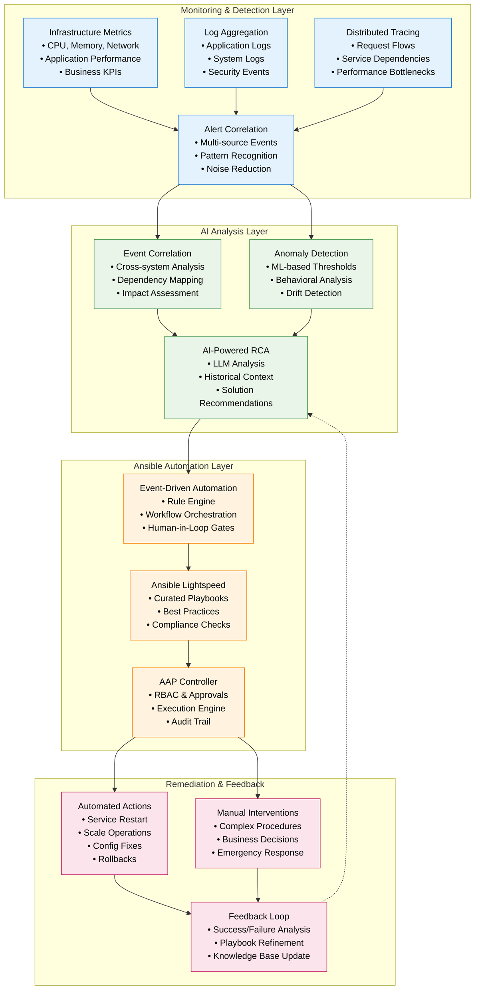

### Intelligent Incident Response Workflow

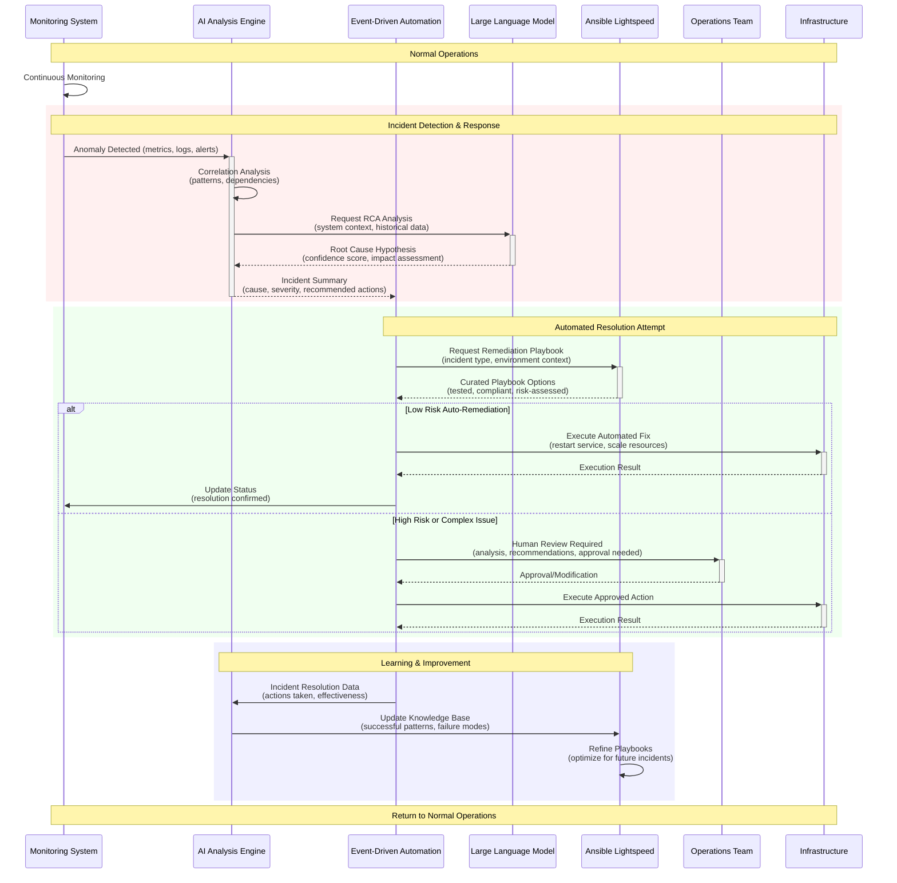

### AIOps Implementation Patterns

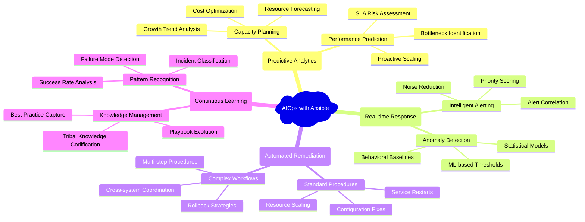

### Business Value Metrics

**Operational Efficiency:**
- **Mean Time to Detection (MTTD)**: Reduce from hours to minutes through intelligent monitoring
- **Mean Time to Resolution (MTTR)**: Cut resolution time by 60-80% with automated remediation
- **False Positive Rate**: Decrease alert noise by 70% through AI-powered correlation
- **Automation Coverage**: Achieve 80% of standard incidents automated with human oversight

**Cost & Resource Optimization:**
- **Operational Costs**: Reduce manual intervention costs by 50-70%
- **Resource Utilization**: Optimize infrastructure usage through predictive scaling
- **Downtime Reduction**: Minimize business impact through proactive issue prevention
- **Staff Productivity**: Free operations teams for strategic initiatives vs. reactive firefighting

---

## 4. Use Case #3 — Infrastructure Provisioning & Configuration

### Strategic Answer

**Problem:** Modern AI/ML workloads require complex, heterogeneous infrastructure with specific security, performance, and compliance requirements that are difficult to provision and maintain consistently across environments.

**Solution:** Ansible provides **declarative infrastructure-as-code** with specialized templates and workflows for AI-ready infrastructure that ensures security, compliance, and optimal performance from the ground up.

### Supporting Arguments

1. **AI-Optimized Infrastructure**: Pre-configured templates for GPU clusters, high-performance storage, and low-latency networking
2. **Security-by-Design**: Built-in hardening, compliance frameworks (NIST, CIS, SOC2), and zero-trust networking principles
3. **Multi-Cloud Consistency**: Identical infrastructure patterns across AWS, Azure, GCP, and on-premises environments
4. **Scalable Provisioning**: Automated scaling from development environments to production-grade AI infrastructure

### Infrastructure Provisioning Architecture

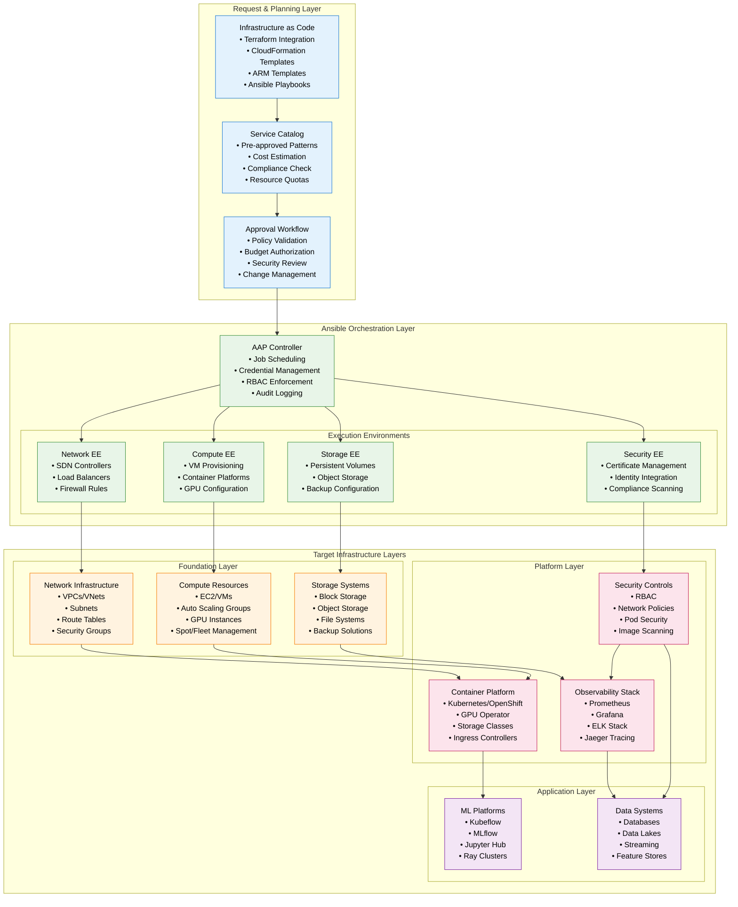

### GPU-Optimized Infrastructure Provisioning

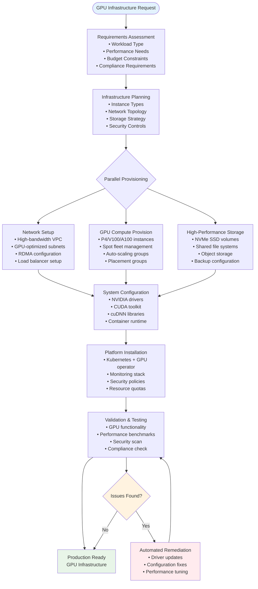

### Security Hardening Pipeline

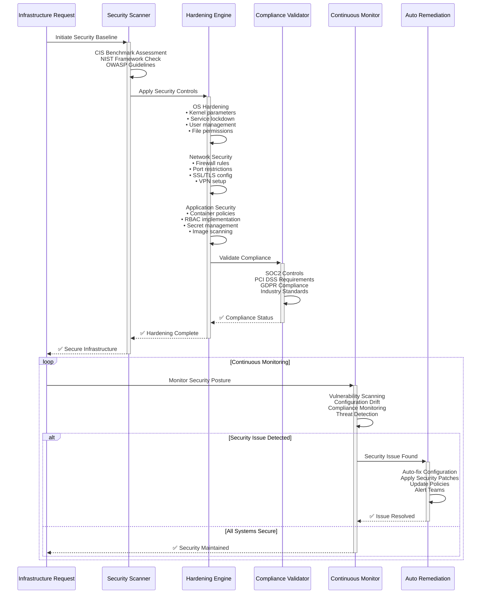

### Implementation Benefits

**Infrastructure Consistency:**
- **Standardized Patterns**: Reusable infrastructure templates ensure consistency across environments
- **Version Control**: Infrastructure changes tracked, reviewed, and auditable through Git workflows
- **Configuration Drift Prevention**: Continuous compliance monitoring and automatic drift correction
- **Multi-Environment Parity**: Development, staging, and production environments remain identical

**Security & Compliance:**
- **Security-by-Design**: Built-in security controls from initial provisioning
- **Automated Compliance**: Continuous monitoring against CIS, NIST, and industry frameworks
- **Zero-Trust Implementation**: Network segmentation and identity-based access controls
- **Certificate Automation**: Automated SSL/TLS certificate lifecycle management

**Operational Efficiency:**
- **Rapid Deployment**: Infrastructure provisioning reduced from weeks to hours
- **Self-Service Capabilities**: Developers can provision approved infrastructure patterns
- **Cost Optimization**: Automated resource rightsizing and spot instance management  
- **Disaster Recovery**: Automated backup and recovery procedures built into all infrastructure

---

## 5. Use Case #4 — MLOps & CI/CD Pipelines

### Strategic Answer

**Problem:** ML model development and deployment lacks the rigor, reproducibility, and operational maturity of traditional software development, leading to inconsistent model performance, deployment failures, and operational risks in production.

**Solution:** Ansible orchestrates **end-to-end MLOps pipelines** that bring DevOps best practices to machine learning, ensuring reproducible, auditable, and scalable model lifecycle management from development through production.

### Supporting Arguments

1. **Pipeline Standardization**: Consistent, repeatable workflows for data ingestion, model training, validation, and deployment
2. **Infrastructure Integration**: Seamless coordination between data platforms, compute resources, and deployment targets
3. **Governance & Compliance**: Built-in model governance, explainability, and regulatory compliance throughout the ML lifecycle
4. **Operational Maturity**: Production-grade monitoring, rollback capabilities, and automated remediation for ML systems

### MLOps Pipeline Architecture

```mermaid
graph TB
    subgraph "Data Layer"
        DataSources[Data Sources<br/>• Operational Databases<br/>• Data Warehouses<br/>• Streaming Platforms<br/>• External APIs<br/>• File Systems]
        DataValidation[Data Validation<br/>• Schema Verification<br/>• Data Quality Checks<br/>• Drift Detection<br/>• Lineage Tracking]
        FeatureStore[Feature Store<br/>• Feature Engineering<br/>• Feature Serving<br/>• Feature Versioning<br/>• Feature Monitoring]
    end

    subgraph "Development & Training Layer"
        Experimentation[Model Experimentation<br/>• Jupyter Notebooks<br/>• MLflow Tracking<br/>• Hyperparameter Tuning<br/>• A/B Testing Framework]
        Training[Distributed Training<br/>• GPU Cluster Management<br/>• Container Orchestration<br/>• Resource Optimization<br/>• Cost Management]
        Validation[Model Validation<br/>• Performance Metrics<br/>• Bias Detection<br/>• Explainability Analysis<br/>• Business Logic Tests]
    end

    subgraph "MLOps Orchestration Layer"
        Pipeline[Ansible Pipeline Controller<br/>• Workflow Orchestration<br/>• Dependency Management<br/>• Error Handling<br/>• Audit Logging]
        Registry[Model Registry<br/>• Version Control<br/>• Metadata Management<br/>• Approval Workflows<br/>• Artifact Storage]
        Governance[ML Governance<br/>• Policy Enforcement<br/>• Compliance Checking<br/>• Risk Assessment<br/>• Approval Gates]
    end

    subgraph "Deployment & Operations Layer"
        Packaging[Model Packaging<br/>• Containerization<br/>• Dependency Management<br/>• Security Scanning<br/>• Image Registry]
        Deployment[Multi-target Deployment<br/>• Kubernetes<br/>• Serverless Functions<br/>• Edge Devices<br/>• Batch Processing]
        Monitoring[Production Monitoring<br/>• Model Performance<br/>• Data Drift<br/>• Infrastructure Health<br/>• Business Metrics]
        Operations[ML Operations<br/>• Auto-scaling<br/>• Rollback Procedures<br/>• Incident Response<br/>• Continuous Learning]
    end

    DataSources --> DataValidation
    DataValidation --> FeatureStore
    FeatureStore --> Experimentation
    Experimentation --> Training
    Training --> Validation
    
    Validation --> Pipeline
    Pipeline --> Registry
    Registry --> Governance
    Governance --> Packaging
    
    Packaging --> Deployment
    Deployment --> Monitoring
    Monitoring --> Operations
    Operations -.->|Feedback Loop| FeatureStore

    classDef data fill:#e3f2fd,stroke:#1976d2,color:#000
    classDef development fill:#e8f5e8,stroke:#388e3c,color:#000
    classDef orchestration fill:#fff3e0,stroke:#f57c00,color:#000
    classDef operations fill:#fce4ec,stroke:#c2185b,color:#000
    
    class DataSources,DataValidation,FeatureStore data
    class Experimentation,Training,Validation development
    class Pipeline,Registry,Governance orchestration
    class Packaging,Deployment,Monitoring,Operations operations
```

### Model Lifecycle Automation Workflow

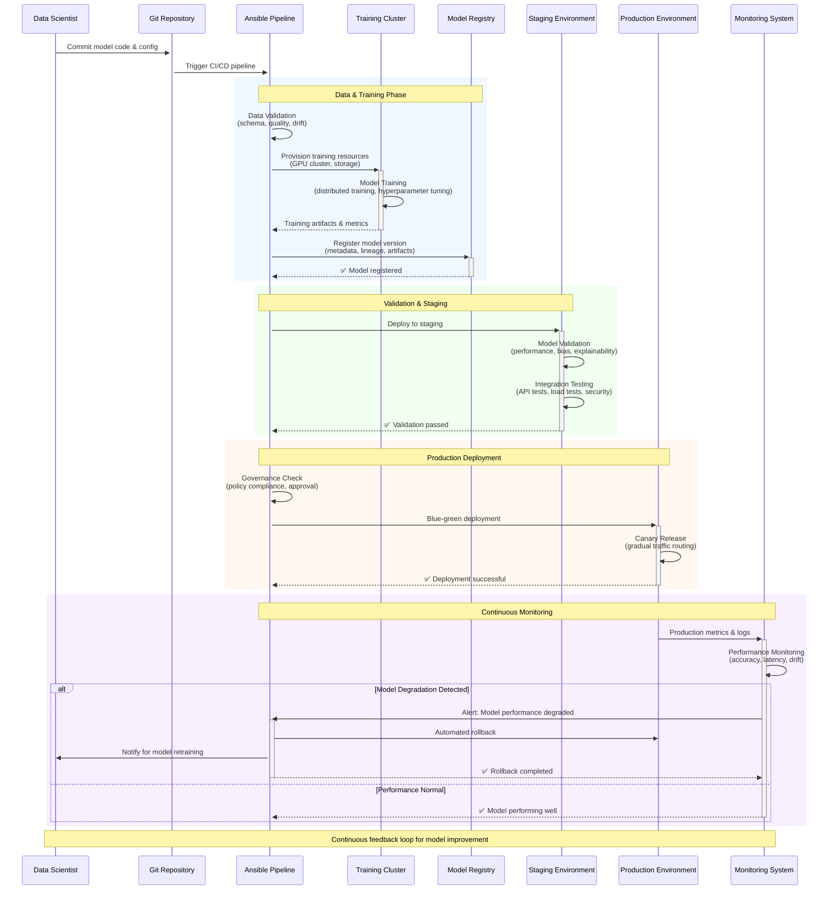

### Advanced MLOps Patterns

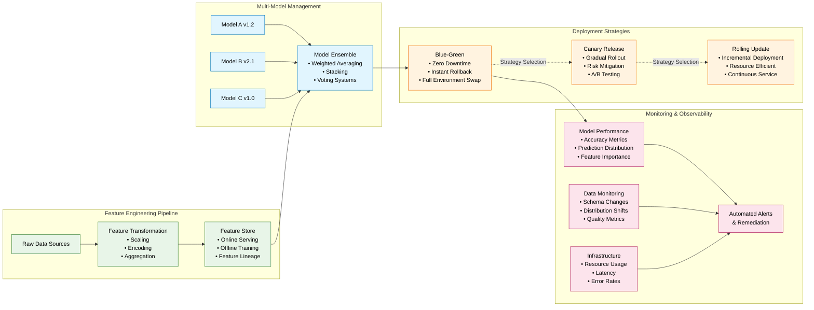

### MLOps Governance Framework

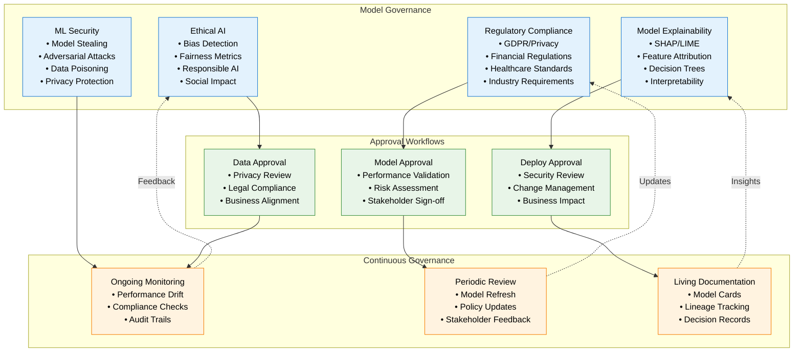

### Business Impact & ROI

**Development Velocity:**
- **Time to Production**: Reduce model deployment time from months to weeks through automated pipelines
- **Experiment Velocity**: Increase model experimentation throughput by 300-500% with standardized workflows
- **Code Reusability**: Achieve 80% code reuse across projects through modular pipeline components
- **Team Productivity**: Enable data scientists to focus on modeling vs. infrastructure management

**Operational Excellence:**
- **Model Reliability**: Achieve 99.9% uptime through automated monitoring and rollback capabilities
- **Deployment Success Rate**: Increase successful deployments from 60% to 95% through validation gates
- **Mean Time to Recovery**: Reduce incident resolution time from hours to minutes via automated remediation
- **Compliance Posture**: Maintain continuous compliance with automated governance and audit trails

**Strategic Value:**
- **Innovation Speed**: Faster model iteration enables rapid response to market changes
- **Risk Reduction**: Systematic testing and validation reduce production failures
- **Scalability**: Platform approach enables scaling from dozens to thousands of models
- **Competitive Advantage**: Superior operational maturity in AI/ML creates differentiation

---

## 6. Constraints & Limitations

### Strategic Answer

**Reality Check:** While Ansible provides powerful orchestration capabilities for AI and enterprise operations, understanding its constraints ensures proper architectural decisions and realistic expectations for implementation success.

### Supporting Arguments

1. **Architectural Boundaries**: Clear understanding of where Ansible excels vs. where other tools are more appropriate
2. **Performance Characteristics**: Recognition of throughput and latency limitations in different scenarios
3. **Operational Considerations**: Planning for stateless execution model and external dependencies
4. **Design Patterns**: Leveraging containers and external services to overcome native limitations

### Platform Constraints Overview

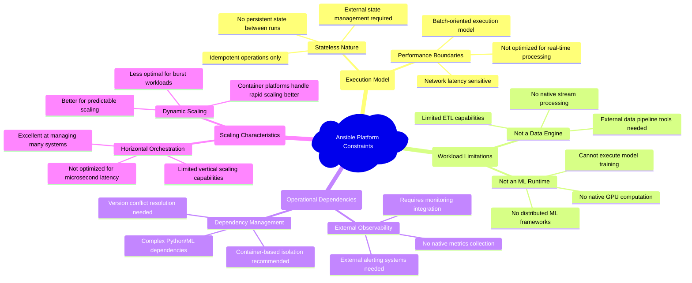

### Constraint Mitigation Strategies

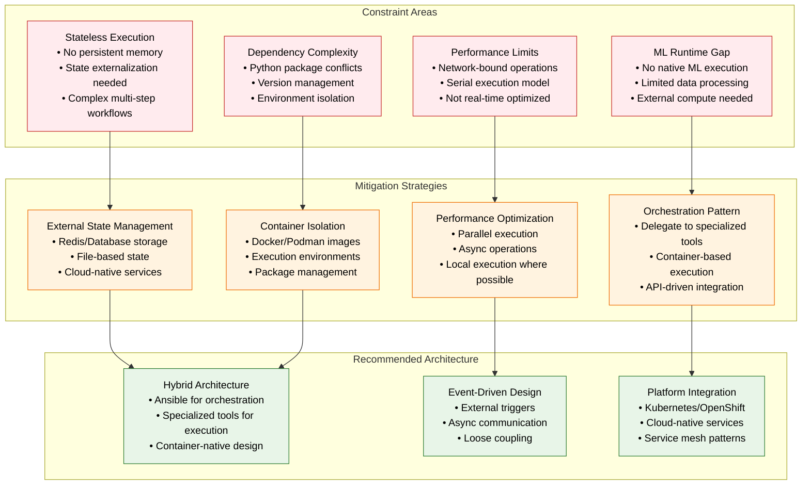

### Design Patterns for Constraint Management

**Container-First Architecture:**
- **Execution Environments**: Use Ansible Execution Environments for dependency isolation
- **ML Workload Delegation**: Container-based execution for complex ML operations
- **Microservices Integration**: API-driven communication with specialized services
- **Resource Management**: Kubernetes/OpenShift for dynamic scaling and resource allocation

**State Management Patterns:**
- **External Persistence**: Redis, databases, or cloud services for state management
- **Immutable Infrastructure**: Rebuild rather than maintain stateful systems
- **Event Sourcing**: Track state changes through event streams
- **Configuration as Code**: Git-based configuration management with external validation

**Performance Optimization:**
- **Parallel Execution**: Leverage Ansible's native parallelization capabilities
- **Local Execution**: Use local actions where network latency is a concern
- **Batch Operations**: Group operations to minimize network round-trips
- **Caching Strategies**: External caching for frequently accessed data

---

## 7. Implementation Pointers

### Strategic Answer

**Implementation Roadmap:** Successful Ansible deployment for AI and enterprise automation requires careful planning, phased implementation, and continuous optimization based on lessons learned.

### Supporting Arguments

1. **Phased Approach**: Incremental implementation reduces risk and enables learning
2. **Technology Integration**: Proper integration with existing tools and platforms
3. **Team Development**: Skills development and organizational change management
4. **Operational Maturity**: Building towards production-grade operational practices

### Implementation Roadmap

```mermaid
gantt
    title Ansible AI Platform Implementation Timeline
    dateFormat  X
    axisFormat %s
    
    section Foundation (Months 1-3)
    Infrastructure Setup    :infra, 0, 3
    Team Training          :training, 0, 2
    Basic Playbook Library :playbooks, 1, 2
    CI/CD Integration      :cicd, 2, 1
    
    section Pilot Programs (Months 3-6)
    Infrastructure Automation :pilot-infra, 3, 2
    Basic AIOps              :pilot-aiops, 4, 2
    Security Hardening       :pilot-security, 3, 3
    
    section Production Deployment (Months 6-12)
    Full MLOps Pipeline     :mlops, 6, 4
    Advanced AIOps          :advanced-aiops, 7, 3
    MCP Brokerage          :mcp, 8, 4
    Multi-Cloud Expansion   :multicloud, 9, 3
    
    section Optimization (Months 12-18)
    Performance Tuning      :perf, 12, 3
    Advanced Governance     :governance, 12, 4
    Platform Scaling        :scaling, 14, 4
    Continuous Improvement  :improvement, 12, 6
```

### Technology Stack Integration

```mermaid
graph TB
    subgraph "Core Ansible Platform"
        AAP[Ansible Automation Platform<br/>• AWX/Controller<br/>• Event-Driven Automation<br/>• Execution Environments<br/>• Content Collections]
        EE[Execution Environments<br/>• Python Dependencies<br/>• Tool Integration<br/>• Security Hardening<br/>• Version Control]
    end
    
    subgraph "Infrastructure Layer"
        Cloud[Multi-Cloud<br/>• AWS/Azure/GCP<br/>• Terraform Integration<br/>• CloudFormation<br/>• ARM Templates]
        Container[Container Platforms<br/>• Kubernetes<br/>• OpenShift<br/>• Docker/Podman<br/>• Service Mesh]
        Monitoring[Observability<br/>• Prometheus<br/>• Grafana<br/>• ELK Stack<br/>• Jaeger/Zipkin]
    end
    
    subgraph "AI/ML Platform"
        MLPlatform[ML Platforms<br/>• Kubeflow<br/>• MLflow<br/>• Ray<br/>• Jupyter Hub]
        DataPlatform[Data Platform<br/>• Apache Spark<br/>• Airflow<br/>• Feature Stores<br/>• Data Lakes]
        ModelServing[Model Serving<br/>• KServe<br/>• Seldon<br/>• TorchServe<br/>• TensorFlow Serving]
    end
    
    subgraph "Enterprise Integration"
        ITSM[IT Service Management<br/>• ServiceNow<br/>• Jira Service Management<br/>• PagerDuty<br/>• Slack/Teams]
        Security[Security Tools<br/>• Vault<br/>• CyberArk<br/>• Splunk<br/>• SentinelOne]
        Governance[Governance<br/>• Git/GitLab<br/>• Compliance Frameworks<br/>• Policy Engines<br/>• Audit Systems]
    end
    
    AAP --> EE
    EE --> Cloud
    EE --> Container
    EE --> MLPlatform
    
    Cloud --> Monitoring
    Container --> DataPlatform
    MLPlatform --> ModelServing
    
    AAP --> ITSM
    AAP --> Security
    AAP --> Governance
    
    classDef core fill:#0b7285,stroke:#034a57,color:#fff
    classDef infra fill:#e3f2fd,stroke:#1976d2,color:#000
    classDef aiml fill:#e8f5e8,stroke:#388e3c,color:#000
    classDef enterprise fill:#fff3e0,stroke:#f57c00,color:#000
    
    class AAP,EE core
    class Cloud,Container,Monitoring infra
    class MLPlatform,DataPlatform,ModelServing aiml
    class ITSM,Security,Governance enterprise
```

### Best Practices Framework

**Development Practices:**
- **Version Control**: All playbooks, roles, and configurations in Git repositories
- **Code Review**: Mandatory peer review for all automation code changes
- **Testing Strategy**: Multi-level testing including syntax, integration, and end-to-end tests
- **Documentation**: Living documentation with architecture decisions and runbooks

**Security Implementation:**
- **Least Privilege**: Role-based access control with minimal required permissions
- **Secrets Management**: External secret management with rotation capabilities
- **Network Security**: Network segmentation and encrypted communications
- **Compliance Automation**: Automated compliance checking and remediation

**Operational Excellence:**
- **Monitoring Integration**: Comprehensive observability across all automated systems
- **Error Handling**: Robust error handling with appropriate escalation procedures
- **Rollback Capabilities**: Automated rollback procedures for all deployment operations
- **Performance Monitoring**: Continuous performance monitoring with optimization opportunities

**Team Development:**
- **Skills Assessment**: Regular evaluation of team capabilities and training needs
- **Knowledge Sharing**: Regular knowledge sharing sessions and documentation reviews
- **Cross-Training**: Ensure multiple team members can support critical operations
- **Community Engagement**: Active participation in Ansible community and best practices

### Success Metrics

**Technical Metrics:**
- **Deployment Frequency**: Number of successful deployments per time period
- **Lead Time**: Time from code commit to production deployment
- **Mean Time to Recovery**: Average time to resolve production incidents
- **Change Failure Rate**: Percentage of deployments causing production issues

**Business Metrics:**
- **Infrastructure Provisioning Time**: Time to provision new infrastructure
- **Operational Cost Reduction**: Cost savings from automation implementation
- **Security Compliance**: Percentage of systems meeting security standards
- **Developer Productivity**: Time developers spend on infrastructure vs. application development

---

## 8. Appendix — Symbols Legend

### Mermaid Diagram Conventions

This document uses standardized symbols and color schemes across all Mermaid diagrams to ensure consistency and readability.

### Color Coding Standards

```mermaid
graph LR
    subgraph "Primary Platform Colors"
        AAP[Ansible Automation Platform<br/>Primary Technology]:::aap
        Core[Core Components<br/>Essential Elements]:::core
    end
    
    subgraph "Layer Classifications"
        Data[Data Layer<br/>Storage & Processing]:::data
        AI[AI/ML Layer<br/>Intelligence & Models]:::ai
        Infra[Infrastructure Layer<br/>Compute & Network]:::infra
        App[Application Layer<br/>Business Logic]:::app
    end
    
    subgraph "Operational States"
        Success[Success State<br/>Completed Operations]:::success
        Warning[Warning State<br/>Attention Required]:::warning
        Error[Error State<br/>Failed Operations]:::error
        Process[Process State<br/>In Progress]:::process
    end
    
    subgraph "Architecture Patterns"
        Control[Control Plane<br/>Orchestration]:::control
        Monitor[Monitoring<br/>Observability]:::monitor
        Security[Security<br/>Governance]:::security
        External[External Systems<br/>Third Party]:::external
    end
    
    classDef aap fill:#0b7285,stroke:#034a57,color:#fff
    classDef core fill:#1976d2,stroke:#0d47a1,color:#fff
    classDef data fill:#e3f2fd,stroke:#1976d2,color:#000
    classDef ai fill:#e8f5e8,stroke:#388e3c,color:#000
    classDef infra fill:#fff3e0,stroke:#f57c00,color:#000
    classDef app fill:#fce4ec,stroke:#c2185b,color:#000
    classDef success fill:#e8f5e8,stroke:#2e7d32,color:#000
    classDef warning fill:#fff8e1,stroke:#f9a825,color:#000
    classDef error fill:#ffebee,stroke:#c62828,color:#000
    classDef process fill:#f3e5f5,stroke:#7b1fa2,color:#000
    classDef control fill:#e1f5fe,stroke:#0277bd,color:#000
    classDef monitor fill:#f9fbe7,stroke:#827717,color:#000
    classDef security fill:#fce4ec,stroke:#ad1457,color:#000
    classDef external fill:#eceff4,stroke:#4c566a,color:#000
```

### Symbol Meanings

**Flow Direction:**
- `-->` : Standard process flow or dependency
- `-.->` : Feedback loop or optional relationship  
- `==>` : Critical path or high-priority flow
- `~~>` : Asynchronous or eventual consistency

**Node Shapes:**
- `[Rectangle]` : Standard process or component
- `(Round)` : Start/end points or external systems
- `{Diamond}` : Decision points or conditional logic
- `[[Subroutine]]` : Subprocess or external call
- `[(Database)]` : Data storage or persistence
- `((Circle))` : Event or trigger point

**Diagram Types:**
- **Flowchart**: Process flows and system interactions
- **Sequence**: Time-based interactions between components
- **Graph**: Relationships and dependencies
- **Mindmap**: Conceptual hierarchies and categorizations
- **Gantt**: Timeline and project planning
- **Pie**: Proportional relationships and distributions

### Architectural Patterns Legend

**Infrastructure Patterns:**
- Multi-cloud deployment strategies
- Container orchestration flows
- Network security implementations
- Storage and data flow patterns

**AI/ML Patterns:**
- Model lifecycle management
- Data pipeline flows
- Training and inference workflows
- Monitoring and observability patterns

**Operational Patterns:**
- Event-driven automation flows
- Incident response workflows
- Change management processes
- Compliance and governance patterns

### Document Structure

This document follows the **Minto Pyramid Principle** for logical structure:

1. **Answer First**: Each section starts with the strategic answer
2. **Supporting Arguments**: Key points that support the main answer
3. **Detailed Evidence**: Diagrams, workflows, and implementation details
4. **Implementation Guidance**: Practical steps and considerations

**Navigation Conventions:**
- All diagrams are properly labeled with `mermaid` code blocks
- Cross-references use consistent anchor linking
- Each major section includes both strategic and tactical content
- Implementation patterns are consistently documented across use cases

---

*This document represents a comprehensive guide to Ansible as a Strategic Platform for AI and Enterprise Automation. For the latest updates and additional resources, please refer to the project repository and official Ansible documentation.*
